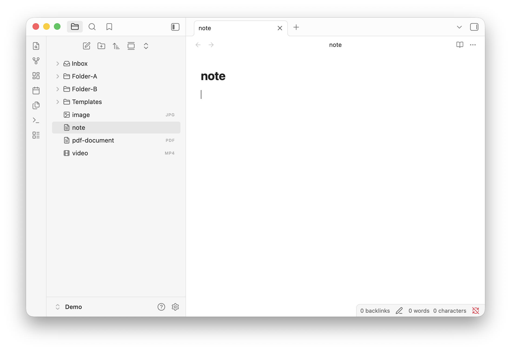

# Obsidian Explorer Icons

A CSS snippet that adds icons to the default file explorer in Obsidian — no plugins required.



## Features

- Adds icons to files and folders in the default explorer
- Works on Obsidian desktop and mobile (iOS/Android).
- Pure CSS - works as a snippet, no plugins needed
- Lightweight and easy to customize

## Installation

1. Download `explorer-icons.css` from this repo and place it in your Obsidian snippets folder (your-vault/.obsidian/snippets/).
2. In Obsidian, go to **Settings → Appearance → CSS snippets** and acivate it.

## Customization

Icons are set using CSS. To change or add an icon, edit the relevant rule in `explorer-icons.css`:

```css
/* Example: icon for a folder named "Projects" */
.nav-folder-title[data-path="Projects"] .nav-folder-title-content::before {
  content: "📁";
}
```

<!-- Adjust the selectors/examples to match how your snippet actually works. -->

## Compatibility

- Tested on Obsidian `v1.12.7`
- Works with the default theme. Custom themes may override these styles.

## Contributing

Issues and pull requests are welcome.

## License

[MIT](LICENSE)
